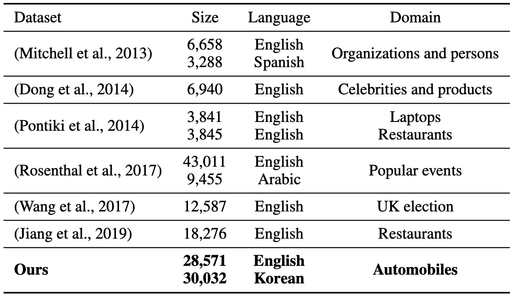
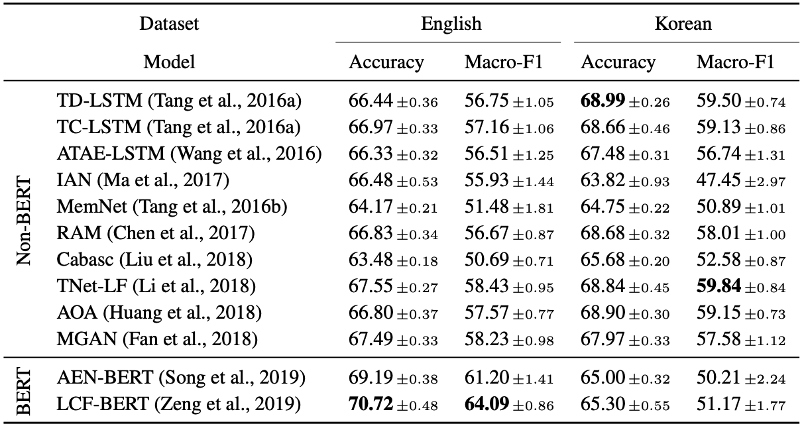

<h1 align="center">
 Building Large-Scale English and Korean Datasets for Aspect-Level Sentiment Analysis in Automotive Domain 
</h1>

           

Official data of
<a href="https://aclanthology.org/2020.coling-main.83/">COLING'20 paper</a>

## Overview

We release large-scale datasets of users’ comments in two languages, English and Korean, for aspect-level sentiment analysis in automotive domain. The datasets consist of 58,000+ commentaspect pairs, which are the largest compared to existing datasets. In addition, this work covers new language (i.e., Korean) along with English for aspect-level sentiment analysis. We build the datasets from automotive domain to enable users (e.g., marketers in automotive companies) to analyze the voice of customers on automobiles. 

We also provide baseline performances for future work by evaluating recent models on the released datasets.

## Data
We are currently considering legal issues regarding data release, and will upload them as soon as possible.
 
## Aspect-level sentiment classifiers
Refer to a repository [here](https://github.com/songyouwei/ABSA-PyTorch), which is based on PyTorch. Simply change the data in the repository with ours to check the performance. 

## Citation
If you use this repository for your work, please consider citing [our paper](https://aclanthology.org/2020.coling-main.83/):

<pre><code> @inproceedings{hyun2020building,
  title={Building Large-Scale English and Korean Datasets for Aspect-Level Sentiment Analysis in Automotive Domain},
  author={Hyun, Dongmin and Cho, Junsu and Yu, Hwanjo},
  booktitle={Proceedings of the 28th International Conference on Computational Linguistics},
  pages={961--966},
  year={2020}
}
</code></pre>
